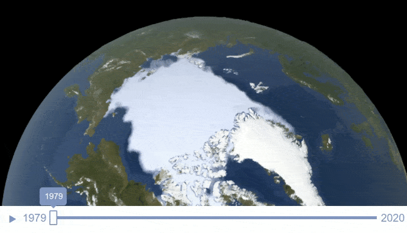
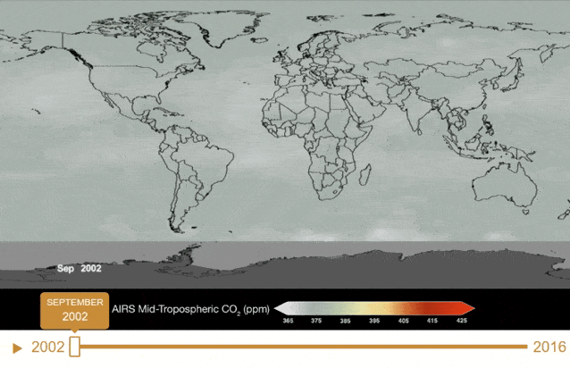
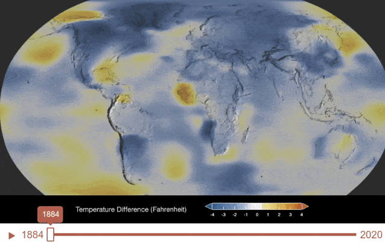
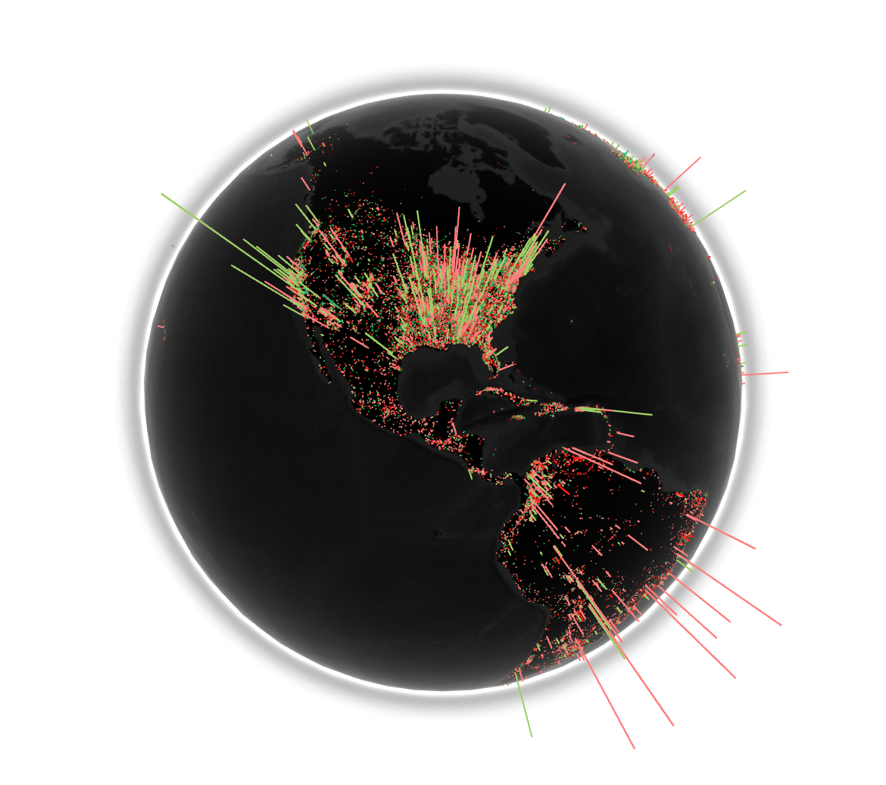

# Proyecto final: Gráficas computacionales

## Ideas de proyecto final 

* ### An Interstellar Experience 

   Revive la experiencia de la película Insterstellar y ve con tus propios ojos el camino que se recorrió. Acompaña a Joseph Cooper en la nave espacial Endurance en este simulador que te hace experimentar la película a tu propio ritmo. Entra por el agujero de gusano hacia una galaxia distante, visita en primera persona el planeta de Miller y experimenta un campo lleno de agua, a su vez que tu tiempo en la tierra se eleva drasticamente. Conoce el hielo del planeta del Dr. Mann o visita los embriones humanos en el planeta de Edmunds donde la Dra. Brand vive.También podrás recorrer el agujero negro de Gargantúa donde encontrarás las sorpresas del final de esta pelícla.

   

  El proyecto está compuesto por vista en primera persona y en tercera persona. Estando tu dentro de los planetas que se presentan en la película podrás ver lo que los ojos de los astronautas pudieron ver. La parte en tercera persona se complementa al momento de elegir tu siguiente parada en la travesía de la película.

 

    Interpretación del mundo de Interstellar en tercera persona

    Idea de interpretación del mundo en primera persona

 

---

* ### Visualizador de las repercuciones del cambio climatico en la Tierra

    Consiste en un visualizador del globo terraqueo donde se muestren los niveles de Hielo, Dioxido de Carbono y Temperatura Global, con la finalidad de informar a la poblacion mundial las mediciones registradas de estos niveles, a lo largo de las ultimas decadas. En caso de tener tiempo de sobra, seria interesante generar un modelo predictivo de niveles en anios proximos, e informar de las repercusiones que traeria consigo, asi como informar de posibles soluciones para contrarestar el problema.

     

    Se utilizaria la API de la NASA (https://github.com/nasa/apod-api) para obtener las mediciones (imagenes satelitales).

     

    Existe un visualizador, muy similar a la idea del proyecto, hecho por la NASA: https://climate.nasa.gov/interactives/climate-time-machine/
    

 

    Niveles de Hielo

    Niveles de Dioxido de Carbono

    Temperatura Global

 

---

* ### WebGL Globe de vacunas de Covid aplicadas mundialmente

    Consiste en agregar un experimento de tipo WebGL Globe (https://experiments.withgoogle.com/chrome/globe), donde se pueda visualizar de manera interactiva las distintas vacunas de COVID-19 aplicadas en tiempo real (un dia de lag), y si el tiempo lo permite, crear un timelapse con todas las mediciones hasta la actualidad, y un modelo para simular cuando terminaria la vacunacion (casi por completo) alrededor del mundo. ]

     

    Ejemplos de como se veria: 

 

