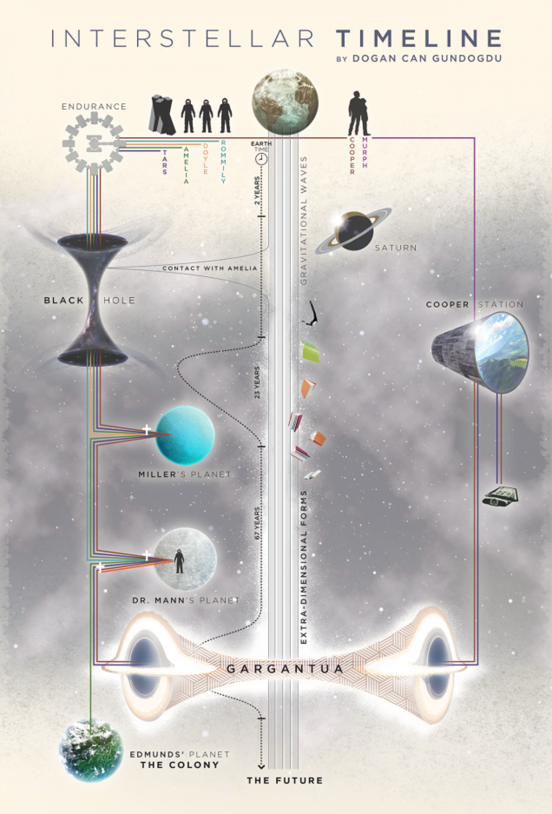
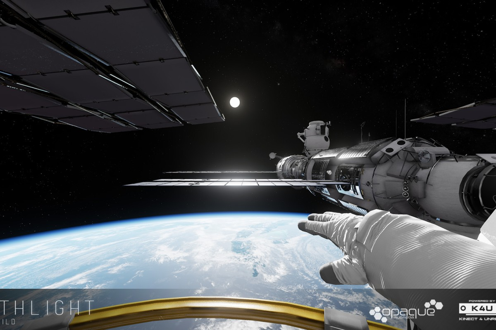

# proyecto_final_graficas

Ideas de proyecto final 

-- An Interstellar Experience 
--

Revive la experiencia de la película Insterstella y ve con tus propios ojos el camino que recorrió. Acompaña a Joseph Cooper en la nave espacial Endurance en esta simulador que te hace experimentar la película a tu propio ritmo. Entra por el agujero de gusano hacia una galaxia distante, visita en primera persona el planeta de Miller y experimenta un campo lleno de agua, a su vez que tu tiempo en la tierra se eleva drasticamente. Conoce el hielo del planeta del Dr. Mann o visita los huevesillos humanos en el planeta de Edmunds donde la Dra. Brand vive.También podrás recorrer el agujero negro de Gargantúa donde encontrarás las sorpresas del final de esta pelícla.

El proyecto está compuesto por vista en primera persona y en tercera persona. Estando tu dentro de los plantas que se presenta la película podrás ver lo que los ojos de los astronautas pudieron ver. La parte en tercera persona se complementa al momento de elegir tu siguiente parasa en la travesía de la película.

______________________________________________________

