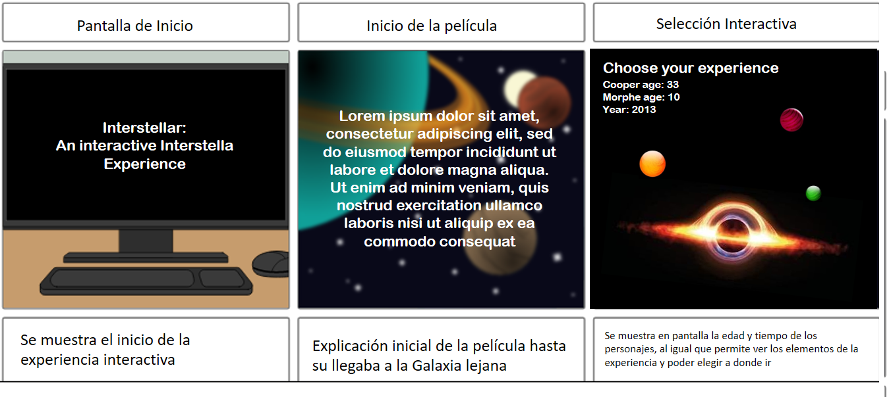

# Proyecto final: Gráficas computacionales

## Ideas de proyecto final 

* ### An Interstellar Experience 

   Revive la experiencia de la película Insterstellar y ve con tus propios ojos el camino que se recorrió. Acompaña a Joseph Cooper en la nave espacial Endurance en este simulador que te hace experimentar la película a tu propio ritmo. Entra por el agujero de gusano hacia una galaxia distante, visita en primera persona el planeta de Miller y experimenta un campo lleno de agua, a su vez que tu tiempo en la tierra se eleva drasticamente. Conoce el hielo del planeta del Dr. Mann o visita los embriones humanos en el planeta de Edmunds donde la Dra. Brand vive.También podrás recorrer el agujero negro de Gargantúa donde encontrarás las sorpresas del final de esta pelícla.

   

  El proyecto está compuesto por vista en primera persona y en tercera persona. Estando tu dentro de los planetas que se presentan en la película podrás ver lo que los ojos de los astronautas pudieron ver. La parte en tercera persona se complementa al momento de elegir tu siguiente parada en la travesía de la película.

 

    Interpretación del mundo de Interstellar en tercera persona

    Idea de interpretación del mundo en primera persona

 

---

* ### Explicación de las escenas del proyecto

    A continuación se explican las escenas de como funcionaría la experiencia iteractiva

   

 

---

* ### Librerias a utilizar
    * WebGL
    * ThreeJS

---

* ### Plan de trabajo

    1.  Redactar guion de la historia a contar, desarrollando narraciones, dialogos, escenas, duracion de estos, etc. **(Liz)**
    2.  Crear todos los assets necesarios, como texturas, materiales, meshes, etc que comprenderan el "universo a desarrollar". **(Liz)**
    3.  Crear el modelo grafico base, para que el usuario pueda "interactuar" con la experiencia grafica. Consistiria en crear templates de escenas, cuadros de dialogos, objetos interactivos, etc. **(Agustin)**
    4.  Tomar el modelo grafico creado, y transcribir el guion creado previamente. **(Agustin)**

 

